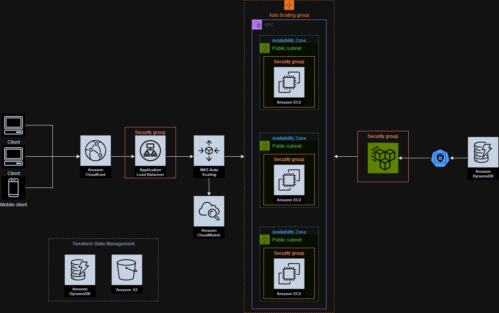

# Web Application Deployment Framework

## Overview

This framework is designed for deploying a scalable and secure web application on AWS with a focus on automation and infrastructure as code (IaC) through Terraform. It simplifies the setup of AWS resources, including networking, compute, storage, and more, with an emphasis on scalability.



## Project Structure

- **Setup Directory (`Setup/`):** Terraform scripts for AWS foundational infrastructure like VPCs and networking.
- **Support Functions (`SupportFunctions/`):** Utilities and Python scripts for additional setup and deployment support.
- **Website Directory (`Website/`):** Terraform scripts for web-specific infrastructure, including EC2 instances, load balancers, and storage solutions.
- **Control Scripts:**
  - `start.sh`: Initiates the deployment, with parameters for specifying AWS Terraform state management resources.
  - `destroy.sh`: Removes all resources provisioned by the framework from AWS.

## Prerequisites

- An AWS account with adequate permissions.
- Terraform and Python installed on your local system.
- AWS CLI configured with your account credentials.

## Configuration and Deployment

### Initial Setup

1. **AWS CLI Configuration:** Ensure the AWS CLI is configured with credentials that have the necessary permissions.
2. **Variable Configuration:**
   - Copy `terraform.tfvars.example` in `Setup/` and `Website/` to `terraform.tfvars` and adjust them with your details.

### Deployment with `start.sh`

The `start.sh` script is designed to automate the initialization and deployment of the required infrastructure and the web application. It uses Terraform to provision resources on AWS and sets up the web application environment. The script supports the following named arguments:

- `--bucket-name`: Specifies the Amazon S3 bucket for storing Terraform state files.
- `--dynamodb-table-name`: Designates the Amazon DynamoDB table for Terraform state locking and consistency checking.
- `--ssh-key`: Provides the path to the SSH key file used for secure connections to the instances.

#### Usage

To deploy the application, execute `start.sh` with the necessary arguments:

```bash
./start.sh --bucket-name <S3BucketName> --dynamodb-table-name <DynamoDBTableName> --ssh-key <SSHKeyPath>
```

- `<S3BucketName>`: The name of your S3 bucket designated for Terraform state files.
- `<DynamoDBTableName>`: The name of your DynamoDB table for state locking.
- `<SSHKeyPath>`: The file path to your SSH key for secure server access.

#### Example Command

```bash
./start.sh --bucket-name my-terraform-state --dynamodb-table-name my-terraform-lock --ssh-key /path/to/my/key.pem
```

This command will initiate the infrastructure setup and website deployment, utilizing the specified S3 bucket and DynamoDB table for Terraform state management and the provided SSH key for secure file transfers.

#### Script Flow

1. **Preparation:** Executes `preparations.py` script from `SupportFunctions/` to prepare the environment.
2. **Terraform Initialization and Application:** In the `Setup/` directory, Terraform is initialized and applied using the provided S3 bucket and DynamoDB table names for state management.
3. **Website Configuration and Deployment:** Moves to the `Website/` directory, updates `terraform.tfvars` with output variables from the setup phase, reinitializes Terraform, and deploys the website resources.
4. **File Transfer:** Establishes a secure SSH connection to the provisioned EC2 instance(s) and transfers necessary files to the server.

#### Post-Deployment

After the deployment, verify the application's functionality and accessibility through the provided public IP addresses and URL's. The script ensures a secure connection by adding the server's IP to known hosts and uses the provided SSH key for file transfers.

### Teardown with `destroy.sh`

To dismantle all AWS resources created by this framework:

```bash
./destroy.sh
```

Ensure you've backed up any important data before executing this command, as it will irreversibly remove all deployed resources.
